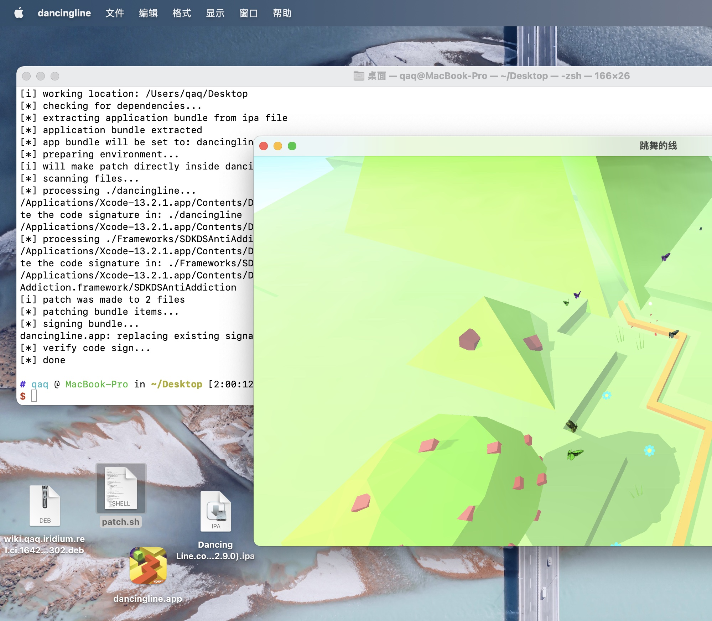

# AppleSiliconUIKitPatch

Script to patch iOS app so we can later use it on Apple Silicon devices.

App should be decrypted if was downloaded from App Store. See [iridium](https://github.com/Co2333/iridium) if you are planing to decrypt it on your own. 

## Preview

## Disclaimer

Use for research purposes only, I didn't publish this for you to sideload Fortnite nor Genshin Impact. :P

## Usage

`./patch.sh some.app/some.ipa`

The result should be generated where you call the script.

## License

This script is licensed under MIT License.

---

2022.1.14

Copyright © 2022 Lakr Aream. All rights reserved.
